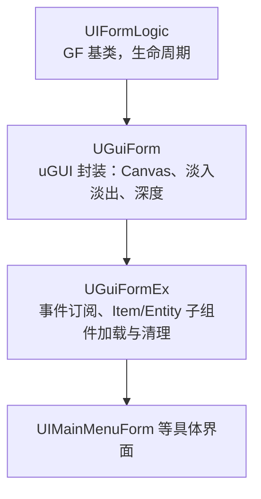
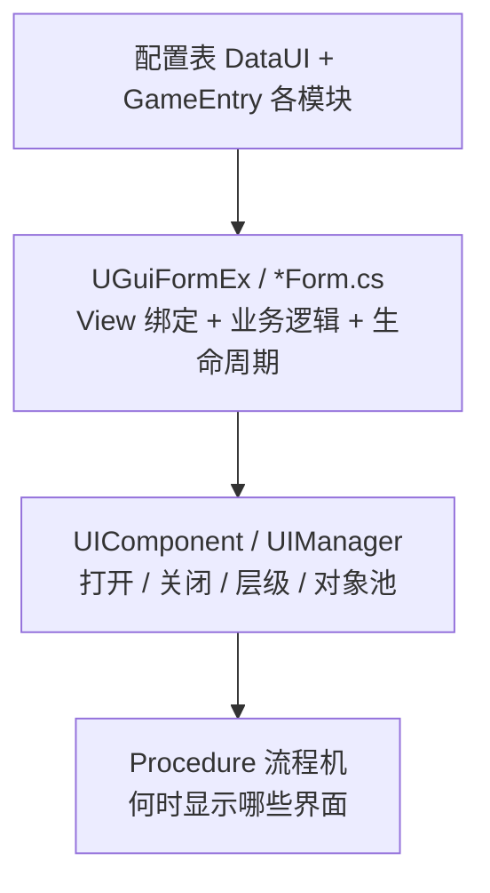

我这个塔防项目的 UI 建立在 **Unity Game Framework（GF）的 UI 模块**之上，在 uGUI 上做了一层项目定制。整理这套框架时，我更关心的其实是几个问题：**界面由谁统一打开和关闭？层级和前后顺序怎么管？菜单弹出弹窗再返回时，下层界面的状态怎么处理？**

这套框架的核心思路可以概括为四点：**数据驱动 + 分层管理 + 生命周期回调 + 与流程（Procedure）联动**。下面按这几点逐一拆开。

> 项目地址：[Xitree/TowerGF](https://github.com/Xitree/TowerGF)

---

## 1. 总体架构：Form 中心，Manager 调度

UI 不是散落在场景里自己管自己，而是统一由 `UIComponent` / `UIManager` 负责打开、关闭、排序和回收。每个界面是一个 **Form（界面）**，对应一个 Prefab + 一个逻辑脚本。

继承关系大致如下：



业务界面（如 `UIMainMenuForm`）只关心按钮点击和 `OnInit` / `OnOpen` / `OnClose`，打开方式统一走：

```csharp
GameEntry.UI.OpenUIForm(EnumUIForm.UILevelSelectForm);
```

---

## 2. 数据驱动：配置表决定「打开什么、在哪一层」

界面信息不在代码里硬编码路径，而是来自**配置表**：

| 配置 | 作用 |
|------|------|
| `UIForm.txt` | 界面 ID、所属 UI 组、资源 ID、是否允许多实例、是否暂停下层界面 |
| `UIGroup.txt` | UI 组名称、深度（层级） |

`DataUI` 在启动时加载这些表，组装成 `UIData`。`UIExtension.OpenUIForm` 的流程是：

1. 用 `EnumUIForm` / int ID 查 `UIData`
2. 取资源路径、UI 组名、是否 `PauseCoveredUIForm`
3. 调用底层 `UIComponent.OpenUIForm(...)`

这样策划改表即可调整界面层级和行为，代码只需维护 `EnumUIForm`（由工具自动生成）。

---

## 3. UI 组（UIGroup）：分层 + 深度排序

项目把界面按功能分成多个 **UI 组**，例如：

- `MainMenu`（主菜单）
- `LevelMainInfo`（关卡 HUD）
- `PausePanel`（暂停）
- `GameOver`（结算）
- `UIMask`、`SpinForm`、`BagForm` 等

每组有独立 `Depth`，通过 `UGuiGroupHelper` 设置 Canvas 的 `sortingOrder`（组间间隔 100）。单个界面在组内还有自己的深度（`UGuiForm.DepthFactor = 100`）。

效果是：**组决定大层级，组内 Form 决定同层内的前后关系**，避免手动调 Canvas 顺序。

---

## 4. 生命周期：栈式界面管理

Game Framework 为每个界面定义了完整生命周期：

- `OnInit` — 初始化（绑按钮、订阅等，通常只执行一次）
- `OnOpen` / `OnClose` — 打开 / 关闭
- `OnPause` / `OnResume` — 被新界面盖住 / 重新显示
- `OnCover` / `OnReveal` — 遮挡 / 恢复
- `OnRefocus` — 重新获得焦点
- `OnUpdate` — 每帧更新
- `OnRecycle` — 回收到对象池

配置里的 `PauseCoveredUIForm` 控制：**新界面打开时，是否暂停被覆盖的界面**（例如主菜单上的弹窗会暂停主菜单逻辑）。

`UGuiForm` 在 `OnOpen` / `OnResume` 里做**淡入淡出**（`CanvasGroup`），关闭时可带淡出动画。

> [!NOTE] 为什么不用 SetActive
> 用 Pause / Cover / Resume 这套回调处理界面栈，比手写 `SetActive` 更贴合「菜单 → 弹窗 → 返回」这类栈式导航——被盖住的界面能明确知道自己该暂停逻辑，恢复时也有对应回调，而不是简单地开关物体。

---

## 5. 对象池与单例约束

`UIManager` 对界面 Prefab 做**实例池**复用。配置里 `AllowMultiInstance = FALSE` 时，同一界面不能重复打开（正在加载或已存在会直接返回），避免重复弹窗。

---

## 6. 与游戏流程（Procedure）结合

UI 的显示 / 隐藏和 **Procedure 状态机**绑定。例如 `ProcedureMenu` 进入时：

```csharp
GameEntry.UI.OpenUIForm(EnumUIForm.UIMainMenuForm);
GameEntry.UI.OpenDownloadForm();
```

离开菜单流程时会切场景、停 BGM 等。UI 是流程的一部分，而不是全局常驻乱开。

---

## 7. `UGuiFormEx`：界面内的「子组件系统」

复杂界面不把所有逻辑堆在一个 Prefab 里，而是通过 **Item / Entity 加载器**动态创建子 UI 单元（列表项、小部件等）：

- `ShowItem` / `HideItem` — 加载 UI Item（类似轻量 Entity）
- `ShowEntity` / `HideEntity` — 在 UI 里挂 3D Entity
- `Subscribe` — 订阅游戏事件
- 关闭界面时自动 `UnSubscribeAll`、`HideAllItem`，避免泄漏

这是 Game Framework **Entity / Item 体系在 UI 层的延伸**，适合列表、动态内容。

---

## 8. 设计思想总结

| 思想 | 体现 |
|------|------|
| **中心化调度** | 所有界面经 `GameEntry.UI` 打开 / 关闭 |
| **数据驱动** | 路径、层级、行为由 `UIForm` / `UIGroup` 表配置 |
| **分层渲染** | UI 组 + 界面双层 Depth 管理 |
| **生命周期驱动** | 用 Pause / Cover / Resume 处理界面栈，而非简单 SetActive |
| **与 GF 生态一致** | 事件、资源、对象池、Procedure 统一风格 |
| **Form 即 Controller** | 每个 `*Form.cs` 既是 View 绑定又是逻辑控制，不是严格 MVVM |

整体分层可以概括为：



---

## 9. 和 MVC / MVP / MVVM 的定位对比

MVC / MVP / MVVM 的核心都是**把「数据、展示、交互逻辑」拆开**，区别在于**谁来协调 Model 和 View**。这三种模式我在另一篇里用血量 UI 示例做过详细对比，这里不再展开：[Unity 中的 MVC / MVP / MVVM](/posts/unity/ui/mvcmvpmvvm/)。

回到本项目，它更接近 **「Form-centric + 中心化 UI Manager」**，而不是严格的 MVC / MVP / MVVM：

- **没有**独立的 Presenter / ViewModel 层
- **没有**数据绑定框架
- `UIMainMenuForm` 既拖 `Button` 引用，又写 `OnClick` 和 `OpenUIForm`，View 与 Controller 合在一个类里

和常见方案的差异：

- **不是** Unity UI Toolkit / UXML 方案，而是 **uGUI + Prefab**
- **不是**典型 MVVM（没有 ViewModel 绑定层），而是 **Form Logic 直接写业务**
- **接近**传统 MMO / 手游的**「界面管理器 + 界面栈 + 配置表」**模式，和 Game Framework 官方 Demo 一脉相承

---

## 10. 优劣势与取舍

### 本项目（Form + GF UI Manager）的优势

1. **上手快、路径短**：一个界面一个脚本，改 Prefab、绑按钮、写点击，没有 Presenter / ViewModel 的额外抽象。
2. **与 Game Framework 生态一致**：资源加载、对象池、Procedure、Event、Item / Entity 加载都按同一套 `GameEntry` 风格，塔防这类中型项目协调成本低。
3. **数据驱动配置**：`UIForm.txt` / `UIGroup.txt` 管 ID、UI 组、资源 ID、是否允许多实例、是否暂停下层界面；`UIExtension.OpenUIForm` 再统一读取配置打开界面。
4. **生命周期适合界面栈**：`PauseCoveredUIForm`、`OnOpen`、`OnClose`、`OnPause`、`OnResume` 比手写 `SetActive` 更适合「主菜单 → 弹窗 → 返回」「关卡 HUD → 暂停面板 → 结算」这类流程。
5. **状态刷新路径直观**：像 HP、能量、波次进度这类 HUD，直接通过事件回调改 `Text` / `Image`，不用引入绑定框架，调试时能很快定位是谁改了 UI。
6. **适合当前项目的 UI 类型**：主菜单、关卡选择、暂停、结算、背包、商店、BattlePass 等界面都更偏游戏弹窗和 HUD，重点是打开顺序、层级和流程联动，而不是复杂表单或多端状态同步。

### 本项目框架的劣势

1. **Form 后续容易变「上帝类」**：目前还算可控，但如果像登录周奖励、背包、商店、BattlePass 这类界面继续增加网络回调、列表刷新、奖励动画和条件显示，就容易把逻辑全部堆进 `*Form.cs`。
2. **View 与逻辑耦合**：Form 继承 `MonoBehaviour`，同时持有 `Button` / `Text` / `Image` 引用、注册按钮事件、访问 `GameEntry.Data`，逻辑很难脱离 Unity 做单元测试。
3. **缺少声明式 UI 更新**：HP、能量、波次等状态变化都要手动写 `hpText.text = ...`、`waveProgressImg.fillAmount = ...`，字段一多就会出现重复刷新和漏刷问题。
4. **跨界面状态共享不系统**：当前主要靠 `GameEntry.Data`、Event、以及少量 Controller（如 `LoginWeekController`）串联，不像 Redux / MVI 那样有统一的 UI 状态树。
5. **Prefab 与脚本字段强绑定**：Form 里大量 `public Button`、`public Text` 字段直接拖引用，UI 结构一改，脚本字段和 Prefab 引用就要同步维护。

### 相对 MVC / MVP / MVVM 的对比（参考）

| 维度 | MVC | MVP | MVVM | 本项目 Form 框架 |
|------|-----|-----|------|------------------|
| 学习曲线 | 中 | 中高 | 高 | **低** |
| 小界面开发速度 | 中 | 慢 | 中（有工具则快） | **快** |
| 大界面可维护性 | 中 | **高** | **高** | 中偏低 |
| 可测试性 | 中 | **高** | **高** | 低 |
| 与 GF / Procedure 契合 | 需适配 | 需适配 | 需适配 | **原生** |
| 列表 / 多弹窗层级 | 看实现 | 看实现 | 看实现 | **内置** |
| 策划配置驱动 | 看实现 | 看实现 | 看实现 | **内置** |

---

## 11. 怎么去选择呢？

**本项目当前模式适合：**

- 塔防、关卡、菜单、商店等**界面数量中等、逻辑以游戏系统为主**的场景
- 团队小、追求与 GF 一致、快速迭代
- UI 复杂度主要在**打开顺序、层级、与游戏流程联动**，而不是复杂表单 / 多端同步

**更适合引入 MVP / MVVM 的场景：**

- 单个界面超过 500 行、大量动态列表和条件显示
- 需要**单元测试** UI 逻辑（经济系统、背包规则）
- 同一套数据要**多 View 展示**（PC / 手机不同布局）
- 使用 **UI Toolkit** 并想做绑定

---

## 总结

MVC / MVP / MVVM 的核心都是**把「数据、展示、交互逻辑」拆开**；本项目则是**把展示和交互合在 Form 里，用 Manager + 配置表 + Procedure 管生命周期和导航**。

它的优势是**快、贴合 GF、适合游戏 UI 栈**；劣势是**界面一复杂就容易臃肿、难测**。
